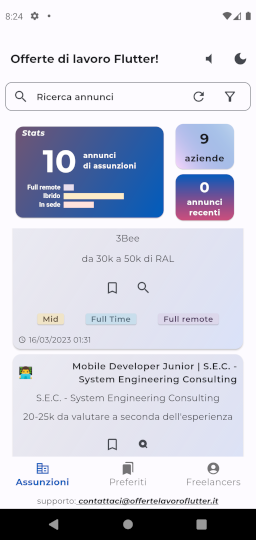

# job_app

Progetto Flutter per la hackaton Fudeo

## Getting Started

Per compilare il progetto occore sia presente un file config.json (ad es: nella directory lib)
di questo tipo: 

{

    "NOTION_TOKEN":"Bearer <YOUR API TOKEN>"
    
}

e lanciare la build con il seguente comando:
flutter build apk  --dart-define-from-file=lib\config.json

La app permette di scaricare e visualizzare gli annunci di lavoro da offertelavoroflutter.it.
Le pagine principali riguardano gli annunci di assunzione da parte di aziende e gli annunci per freelancers.
L'utente può scorrere gli annunci (lista verticale se il dispositivo è in portrait o lista orizzontale se in landscape).
Gli annunci sono visualizzati con un infinte scrolling che recupera gli annunci lato server usando la paginazione (al momento 2 per volta per testare la paginazione)
Il numero di annunci per pagina è impostabile nel file lib\app\resources\app_consts.dart (const kNumeroDiAnnunciPerPagina = 2;)

Prima della lista degli annunci sono visualizzate le statistiche relative agli annunci finora scaricati. (numeri e grafici)

E' possibile effettuare una ricerca inserendo un termine chiave e filtrando per le caratteristiche dell'annuncio (tipo di contratto, tipo di esperienza ricercata ecc.)
I filtri sono attivabili cliccando sull'icona filtro al fondo della barra di ricerca.

L'utente può resettare la ricerca cliccando su un icona nella barra di ricerca.

L'utente può scegliere anche se usare il tema chiaro o scuro (prefernza che viene salvata anche alla chiusura della app)

Cliccando su un'icona al centro di ogni annuncio se ne visualizza il dettaglio e l'utente può spuntare l'annuncio come preferito (al momento viene colorata solo l'icona)

Nella pagina di dettaglio l'utente può inoltre condividere l'annuncio cliccando sulla prima icona "share".

Al fondo della pagina l'utente può cliccare per ottenere supporto via email.

Sono presenti alcuni suoni al cambio del tema e nel reset. L'utente può mettere la appa in modalità silenziosa cliccando sull'icona "altoparlante" nella Appbar.

La app è provvista di icona launcher personalizzata.

TODO: manca la pagina dei "preferiti"

A few resources to get you started if this is your first Flutter project:

- [Lab: Write your first Flutter app](https://docs.flutter.dev/get-started/codelab)
- [Cookbook: Useful Flutter samples](https://docs.flutter.dev/cookbook)

For help getting started with Flutter development, view the
[online documentation](https://docs.flutter.dev/), which offers tutorials,
samples, guidance on mobile development, and a full API reference.
